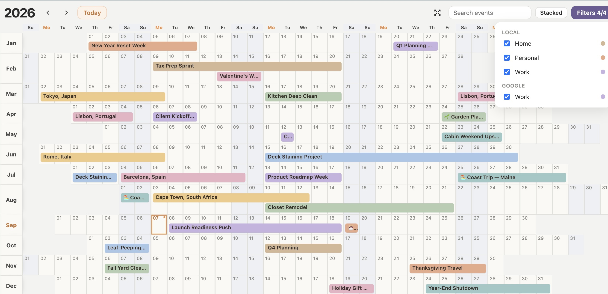

# Linear Year Calendar

An Obsidian plugin that shows your whole year at a glance: 12 month rows, pastel event bars, Linear / Stacked / Column / Col-Stack layouts, click or drag to create notes, an event detail popover, and Google Calendar import via ICS.



---

## Install

### Community plugins (once listed)

1. Open Obsidian → Settings → Community plugins.
2. Turn **Restricted mode** off if it is on.
3. Browse → search **Linear Year Calendar** → Install → Enable.

### Manual install (from a GitHub release)

1. Create `VaultFolder/.obsidian/plugins/linear-year-calendar/`.
2. From the [latest release](https://github.com/gzd2032/linear_calendar_obsidian/releases/latest), download these three assets into that folder:
   - `manifest.json`
   - `main.js`
   - `styles.css`
3. Enable **Linear Year Calendar** under Community plugins.

Ignore GitHub’s auto-generated **Source code** zip/tar — that is the whole repository, not the plugin install package. Obsidian only uses the three files above.

---

## Open the view

Use the calendar ribbon icon, or run **Open Linear Year Calendar** from the command palette.

---

## How it works

**Google Calendar is the source of truth** for imported events. **Obsidian is for local planning.**

| Kind | Folder | In Obsidian |
| --- | --- | --- |
| Local planning | `Calendar/<CalendarName>/` | Create, edit, delete |
| Google ICS | `Calendar/google/<CalendarName>/` | View only; open the day in Google Calendar |

Click or drag creates notes in the **Default calendar name** folder (settings). In the create/edit modal, pick a **local** calendar from the dropdown, or choose **Other…** to name a new one (Google calendars are not listed). Changing calendar on edit moves the note into that folder. Filters group **Local** vs **Google**.

| Action | What happens |
| --- | --- |
| Click a day | Create a one-day local event note |
| Drag across days | Create a multi-day local event note (live range preview) |
| Click a local event bar | Detail popover (open note / edit / delete) |
| Click a Google event bar | Read-only popover; **Google** opens that day in Google Calendar |
| Hover an event bar | Tooltip with title, dates, day count |
| **Today** (next to year arrows) | Jump to the current year and center on today |
| Display | Switch Stacked / Linear / Column / Col-Stack |
| Filters | Local and Google sections; **Show all** when some are hidden |
| Search | Filter bars by title |
| Year arrows | Move year |

### Layouts

- **Linear** — day 1 of every month is in the first column.
- **Stacked** — months are offset so Sundays (or Mondays) stack in the same columns.
- **Column** — months sit side by side with days top to bottom; events appear inside each month on their days.
- **Col-Stack** — like Column, but months are weekday-aligned so weekends line up horizontally across the year.

---

## Event notes

Local events are Markdown notes with YAML frontmatter:

```yaml
---
start: 2026-09-07
end: 2026-09-15
color: "#E7A989"
calendar: Personal
---
# Home Office Makeover

Optional description lives in the note body.
```

---

## Google Calendar via ICS

1. In Google Calendar, open **Settings**.
2. Under **Settings for my calendars**, select a calendar.
3. Open **Integrate calendar**.
4. Copy **Secret address in iCal format**.
5. In Obsidian: Settings → Linear Year Calendar → **Add** under Google calendars.
6. Paste the URL, set a name and color.
7. On the year view, click the refresh icon (or command **Refresh ICS calendars**).

**All-day events only** skips timed meetings when enabled. Timed Google events still import as one-day bars when that setting is off.

Imported events are written under `Calendar/google/<calendar-name>/`, keyed by `ics-uid` + start date so refreshes update instead of duplicating. Do not edit those notes in Obsidian — change them in Google and refresh.

Public ICS URLs work too (`webcal` / `https`). `webcal://` is rewritten to `https://` automatically.

If you previously imported into `Calendar/<name>/` (without `google/`), refresh will write to the new path; you can delete the old ICS notes manually.

---

## Settings

Open **Settings → Linear Year Calendar**.

| Setting | What it does |
| --- | --- |
| **Events folder** | Root folder for calendar notes (default `Calendar`). Local calendars use `<folder>/<Name>/`; Google imports use `<folder>/google/<Name>/`. |
| **Default calendar name** | Local calendar used when you click or drag to create an event. |
| **Week starts on** | Sunday or Monday — used by Stacked and Col-Stack so weekends line up. |
| **Default view** | Layout used when you open the year view. |
| **All-day events only** | When on, skip timed Google meetings on ICS refresh. |
| **Google US holidays** | Optional holiday feed, with a color picker. Refresh ICS after enabling. |
| **Google calendars** | Add, enable/disable, color, and test ICS sources. Names map to `Calendar/google/<Name>/`. |

Use **Refresh ICS calendars** (toolbar or command) after changing ICS sources. The settings page shows the last refresh time and per-calendar results when available.

---

## Known limits

- Google / ICS events are **read-only** in Obsidian. Edit them in Google, then refresh.
- Timed Google events render as **one-day** bars (not hour blocks).
- ICS recurrence covers common Google series (including weekly `BYDAY` and `EXDATE`). Some monthly patterns and edge cases may still land wrong or incomplete.
- Recurring series are capped when expanding occurrences so a bad rule cannot flood the vault.
- The plugin reads Markdown notes under your events folder (and related vault paths) to draw the year grid.
